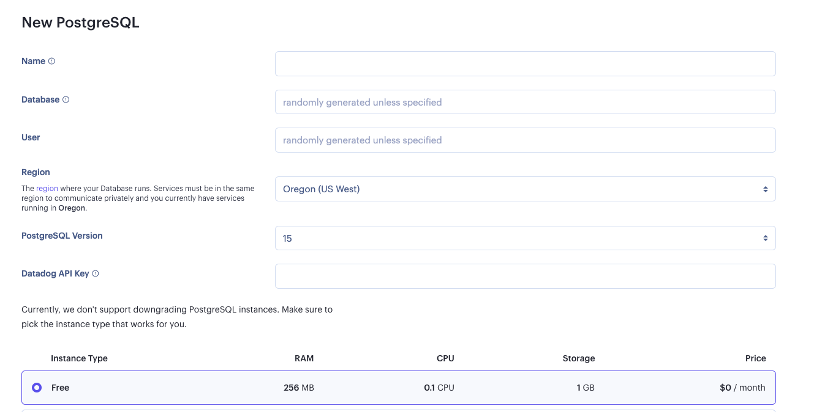
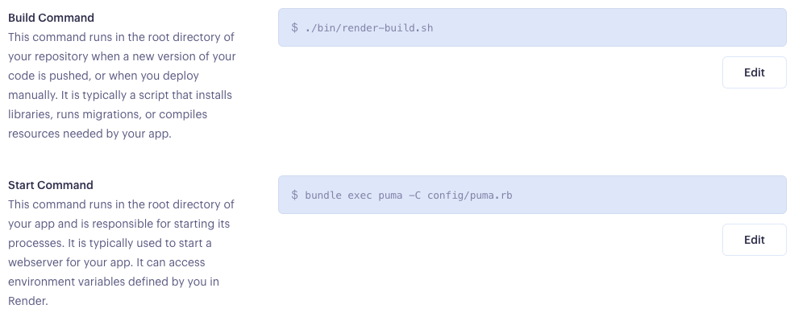
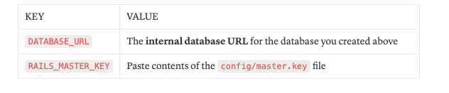

# Deployment to Render

## In your Rails App
*** Create directory in app/javascript called `_tests_` and move all `test.js` files to this folder. ***

1. Open config/database.yml and find the production section at bottom of the file. Modify it to gather the database configuration from the DATABASE_URL environment variable:

`config/database.yml`
```ruby
 production:
  <<: *default
  url: <%= ENV['DATABASE_URL'] %>
```
2. Open `config/puma.rb` and uncomment and update the green highlighted lines for:
- `workers ENV.fetch("WEB_CONCURRENCY") {4}` // Change the {2} to {4}
- preload_app!
```ruby
# Puma can serve each request in a thread from an internal thread pool.
# The `threads` method setting takes two numbers: a minimum and maximum.
# Any libraries that use thread pools should be configured to match
# the maximum value specified for Puma. Default is set to 5 threads for minimum
# and maximum; this matches the default thread size of Active Record.
#
max_threads_count = ENV.fetch("RAILS_MAX_THREADS") { 5 }
min_threads_count = ENV.fetch("RAILS_MIN_THREADS") { max_threads_count }
threads min_threads_count, max_threads_count

# Specifies the `worker_timeout` threshold that Puma will use to wait before
# terminating a worker in development environments.
#
worker_timeout 3600 if ENV.fetch("RAILS_ENV", "development") == "development"

# Specifies the `port` that Puma will listen on to receive requests; default is 3000.
#
port ENV.fetch("PORT") { 3000 }

# Specifies the `environment` that Puma will run in.
#
environment ENV.fetch("RAILS_ENV") { "development" }

# Specifies the `pidfile` that Puma will use.
pidfile ENV.fetch("PIDFILE") { "tmp/pids/server.pid" }

# Specifies the number of `workers` to boot in clustered mode.
# Workers are forked web server processes. If using threads and workers together
# the concurrency of the application would be max `threads` * `workers`.
# Workers do not work on JRuby or Windows (both of which do not support
# processes).
#
workers ENV.fetch("WEB_CONCURRENCY") { 4 }

# Use the `preload_app!` method when specifying a `workers` number.
# This directive tells Puma to first boot the application and load code
# before forking the application. This takes advantage of Copy On Write
# process behavior so workers use less memory.
#
preload_app!

# Allow puma to be restarted by `bin/rails restart` command.
plugin :tmp_restart
```
3. Open `config/environments/production.rb` and enable the public file server when the `RENDER` environment variable is presesnt (which ***always is*** on Render):
```ruby
  # Disable serving static files from the `/public` folder by default since
  # Apache or NGINX already handles this.
  config.public_file_server.enabled = ENV["RAILS_SERVE_STATIC_FILES"].present? || ENV['RENDER'].present?
  ```
### Create a Build Script
4. You will need to run a series of commands to build your app. This can be done using a build script. Create a script called `bin/render-build.sh` at the root of your repository:
```ruby
set -o errexit

bundle install
bundle exec rake assets:precompile
bundle exec rake assets:clean
bundle exec rake db:migrate
```
5. Make sure the script isexecutable before checking it into Git:
`chmod a+x bin/render-build.sh`

### Create a yarn rake file
6. Create a `yarn.rake` file in the tasks directory below. Add the line of code below to the file and save.

`/lib/tasks/yarn.rake`
```ruby
Rake::Task["assets:precompile"].enhance ["yarn:install"]
```
### Add linux platform to Gemfile.lock
in terminal run:
`bundle lock --add-platform x86_64-linux`

7. Commit all changes and push them to your GitHub repository. Now your application is ready to be deployed on Render!

# Deploy to Render

## Go To Render.com
1. Create account using the GitHub option to sign up

### Postgres
2. Create New PostgreSQL Database
  

3. Select Free Plan

4. Copy Internal Database URL to be used later 

### Web Service
1. Create a new Web Service, pointing it to your application repository(make sure Render has access to it)

2. Select `Ruby` for the environment and set the following properties:
  

3. Add the following environment variables under the *** Advanced *** section:
  

That's it! You can now finalize your service deployment. It will be live on your `.onrender.com` URL as soon as the build finishes.

## Troubleshooting
During deployment, your build might encournter some errors. 
- `error Command "webpack" not found` <br>
 This means you forgot to add the `yarn.rake` task to your code.  Look at ***Create yarn rake file*** above.

- `Your bundle only supports platforms ["x86_64-darwin-19"] but your local platform is x86_64-linux. Add the current platform to the lockfile with` `bundle lock --add-platform x86_64-linux` `and try again.`

run command: 
`$ bundle lock --add-platform x86_64-linux`


